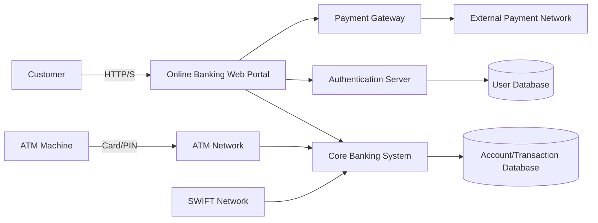
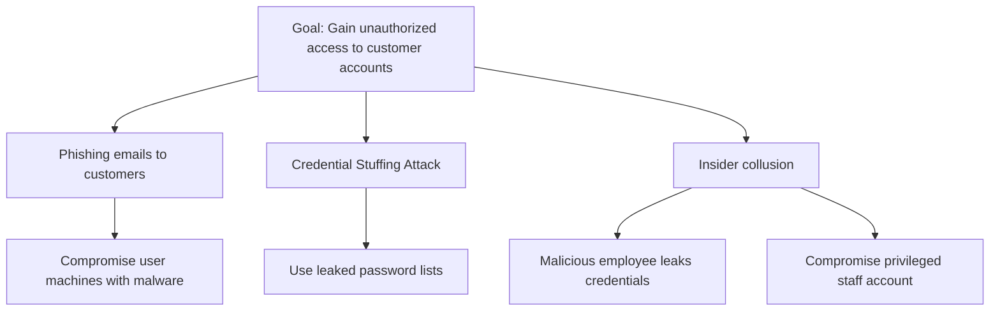
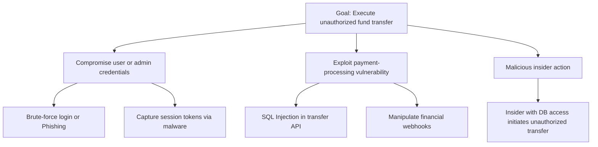

# Threat Modeling Report – UK International Bank

## Executive Summary

This report presents a threat modeling analysis of the UK-headquartered international bank’s systems, focusing on online banking, core services, and related infrastructure. Given the high stakes of financial data and transactions (Toreon, 2025), we adopted a proactive, structured process to identify “what can go wrong” early in the design. Key assets (e.g. customer PII and financial records) and critical system components were identified, and threats were categorized and prioritized. Using industry-standard frameworks (STRIDE, DREAD, MITRE ATT&CK) and attack-tree visualizations, we assessed and scored threats. The Executive Summary highlights major findings: for example, credential theft and injection attacks emerged as high-risk scenarios, and mitigations such as multi-factor authentication and input validation are recommended. Overall, this modeling ensures security measures are integrated from the outset, aligning with best practices in financial security.

---

## System Context & Data Flow Overview

The bank’s IT ecosystem includes online banking applications (web and mobile), ATM networks, back-end banking servers, and third-party payment interfaces (e.g. SWIFT, card networks). External entities include retail and corporate customers, partner financial networks, and regulators. Internally, key processes are the web/microservice front-ends, authentication/authorization servers, core banking and transaction processors, and data stores (user credentials and account databases).

A data flow diagram (DFD) summarizes how information moves among these components. For instance, customer requests (login, transfers) flow through the Web Portal to the Authentication Server and Core Banking System, which in turn read/write to the User DB and Account DB, while external gateways handle payment routing.

---

## Assets, Adversaries, and Assumptions

### Assets

High-value assets include customer PII, authentication credentials, account balances, and transaction records. Abstract assets include system availability and the bank’s reputation. Infrastructure (servers, networks) and compliance data (audit logs) are also critical.

### Adversaries

Potential attackers include:

* Financially motivated cybercriminals and fraud rings
* Insider threats (employees/contractors)
* Hacktivists and nation-state actors
* Third-party/vendor risks

Each adversary type leverages characteristic tactics (e.g. phishing, DDoS, insider data theft) from CTI frameworks.

### Assumptions

* System architecture and trust boundaries are accurate
* TLS-secured channels are used for data in transit
* No undiscovered zero-days assumed
* Third-party components have baseline security

---

## Methodology

The methodology follows established practices:

1. **System Understanding** – Create DFD and asset inventory.
2. **Threat Identification** – Apply STRIDE (Spoofing, Tampering, Repudiation, Information Disclosure, Denial, Elevation).
3. **Risk Prioritization** – Use DREAD scoring (Damage, Reproducibility, Exploitability, Affected Users, Discoverability).
4. **Mapping** – Cross-reference threats to MITRE ATT&CK techniques (e.g. T1078, T1566, T1657).
5. **Validation** – Peer review and mapping to NIST 800-30 categories.
6. **Mitigation Design** – Align countermeasures to STRIDE categories.

---

## STRIDE Component-by-Component Analysis

### Online Banking Application

* **Spoofing:** Phishing or credential theft (ATT&CK T1078).
* **Tampering:** SQL/CSRF injections (T1190).
* **Repudiation:** Missing audit logs.
* **Information Disclosure:** API data leakage.
* **Denial:** DDoS attacks (T1498).
* **Elevation:** Exploiting web stack vulnerabilities.

### Core Banking Backend

* **Spoofing:** Stolen service credentials.
* **Tampering:** Unauthorized modification of records.
* **Repudiation:** Lack of immutable logging.
* **Information Disclosure:** Database exfiltration.
* **Denial:** Network or power disruptions.
* **Elevation:** Root privilege escalation.

### ATM and Payment Network Interfaces

* **Spoofing:** ATM skimming.
* **Tampering:** Jackpotting malware.
* **Information Disclosure:** Cardholder data leaks.
* **Denial:** DDoS on payment networks.
* **Elevation:** ATM OS exploitation.

---

## Attack Trees

### Attack Tree 1 – Account Takeover

### Attack Tree 2 – Unauthorized Fund Transfer

---

## CVSS Critique

While CVSS provides standardized scoring, it often oversimplifies context-specific risk. Studies show CVSS ratings may exaggerate severity (PortSwigger, 2023). Static scores lack environmental context—thus, a CVSS 9.8 may not reflect real-world risk without considering exploitability or business impact. As SC Media (2025) notes, CVSS should be a starting point, complemented by frameworks like DREAD or FAIR for practical prioritization.

---

## Risk Register

| ID | Threat                      | Asset(s)             | Likelihood | Impact | DREAD Score   | Mitigation                             |
| -- | --------------------------- | -------------------- | ---------- | ------ | ------------- | -------------------------------------- |
| 1  | SQL Injection (Payment API) | Account data         | High       | High   | 42 (Critical) | WAF, input validation, code review     |
| 2  | Credential Phishing         | Customer PII         | High       | High   | 40 (Critical) | MFA, phishing-resistant authentication |
| 3  | DDoS (Web Portal)           | Service Availability | Medium     | High   | 30 (High)     | DDoS protection, rate limiting         |
| 4  | Insider Data Exfiltration   | Customer data        | Low        | High   | 25 (High)     | DLP tools, role-based access control   |
| 5  | Malware Infection           | Core Banking Server  | Medium     | Medium | 22 (Medium)   | EDR, patch management                  |

---

## Mitigation Strategy & Control Mapping

| STRIDE Category          | Mitigation Controls                                 |
| ------------------------ | --------------------------------------------------- |
| **Spoofing/Elevation**   | MFA, least privilege, FIDO tokens                   |
| **Tampering/Disclosure** | Encryption, WAFs, prepared statements               |
| **Repudiation**          | Immutable logs, SIEM monitoring                     |
| **Denial**               | DDoS mitigation, redundancy                         |
| **User Training**        | Anti-phishing awareness, social engineering defense |

Controls align with MITRE mitigations (M1018, M1017) and CRF guidance (2024).

---

## Limitations & Future Work

Threat models represent a snapshot of known risks; continuous updates are essential. DREAD scoring is subjective, and both it and CVSS lack dynamic context. The model assumes current architecture and excludes evolving threats such as supply-chain or LLM-based attacks. Future work should include:

* Continuous threat intelligence integration
* Automated threat-model updates
* Red-team validation and historical incident feedback

---

## References

* Toreon. (2025). *Threat Modeling: A Pragmatic Guide for Financial Services Executives*. [PDF]. [https://www.toreon.com/wp-content/uploads/2025/05/Practical-Guide-for-Finance-Toreon.pdf](https://www.toreon.com/wp-content/uploads/2025/05/Practical-Guide-for-Finance-Toreon.pdf)
* OWASP Foundation. (2023). *Threat Modeling Process*. [https://owasp.org/www-community/Threat_Modeling_Process](https://owasp.org/www-community/Threat_Modeling_Process)
* GeeksforGeeks. (2025). *Data Flow Diagram for Online Banking System*. [https://www.geeksforgeeks.org/software-engineering/data-flow-diagram-for-online-banking-system/](https://www.geeksforgeeks.org/software-engineering/data-flow-diagram-for-online-banking-system/)
* Straight, R. (2023). *Developing Attack Trees with Mermaid*. [https://ryanstraight.com/posts/attack-trees-in-mermaid/](https://ryanstraight.com/posts/attack-trees-in-mermaid/)
* EC-Council. (2022). *DREAD Threat Modeling: An Introduction to Qualitative Risk Analysis*. [https://www.eccouncil.org/cybersecurity-exchange/threat-intelligence/dread-threat-modeling-intro/](https://www.eccouncil.org/cybersecurity-exchange/threat-intelligence/dread-threat-modeling-intro/)
* KELA Cyber. (n.d.). *Understanding the Different Types of Cyber Adversaries*. [https://www.kelacyber.com/academy/cti/understanding-the-different-types-of-cyber-adversaries/](https://www.kelacyber.com/academy/cti/understanding-the-different-types-of-cyber-adversaries/)
* Osborne, C. (2023). *CVSS system criticized for failure to address real-world impact*. *The Daily Swig (Portswigger)*. [https://portswigger.net/daily-swig/cvss-system-criticized-for-failure-to-address-real-world-impact](https://portswigger.net/daily-swig/cvss-system-criticized-for-failure-to-address-real-world-impact)
* CyberRisk Alliance (SC Media). (2025). *Cybersecurity experts defend CVSS amid criticism*. [https://www.scworld.com/brief/cybersecurity-experts-defend-cvss-amid-criticism](https://www.scworld.com/brief/cybersecurity-experts-defend-cvss-amid-criticism)
* Tarala, J. (2024). *Practical Threat Modeling Based on Community Templates*. *CRF*. [https://crfsecure.org/practical-threat-modeling-based-on-community-templates/](https://crfsecure.org/practical-threat-modeling-based-on-community-templates/)
* MITRE ATT&CK. (2025). *Financial Theft (T1657)*. [https://attack.mitre.org/techniques/T1657/](https://attack.mitre.org/techniques/T1657/)
